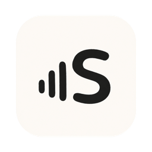

<div align="center">
  
  <h1>Scribe</h1>
  <p>Voice to text app for macOS to transcribe what you say to text almost instantly</p>
</div>

---

Scribe is a native macOS app that transcribes what you say to text almost instantly.

## Features

- 🎙️ **Accurate Transcription**: Local AI models that transcribe your voice to text with 99% accuracy, almost instantly
- 🔒 **Privacy First**: 100% offline processing ensures your data never leaves your device
- ⚡ **Modes**: Intelligent app detection automatically applies your pre-configured settings based on the app or URL you're on
- 🧠 **Context Aware**: Smart AI that understands your screen content and adapts to the context
- 🎯 **Global Shortcuts**: Configurable keyboard shortcuts for quick recording and push-to-talk
- 📝 **Personal Dictionary**: Custom words, industry terms, and smart text replacements
- 🔄 **Smart Modes**: Switch between AI-powered modes optimized for different writing styles
- 🤖 **AI Assistant**: Built-in voice assistant mode for quick conversational use

## Build

```shell
make local
open ~/Downloads/Scribe.app
```

See [BUILDING.md](BUILDING.md) for details.

## Requirements

- macOS 14.4 or later
- Xcode with Command Line Tools

## License

GNU General Public License v3.0 — see [LICENSE](LICENSE).
